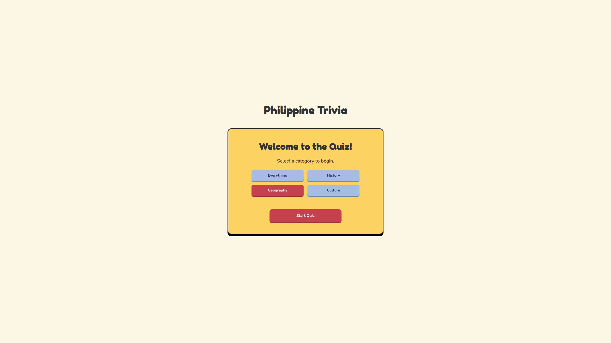

# Philippine Trivia Game

A fun, interactive trivia game built with React and TypeScript, designed to test your knowledge about the Philippines.

## Live Demo

[**Play the game here!**](https://philippine-trivia.vercel.app)

## Screenshot

## Tech Stack

This project was built from scratch using the following technologies:

- **Framework:** React
- **Language:** TypeScript
- **Styling:** CSS Modules
- **Build Tool:** Vite

## What I Learned

As my second major React project, this was a fantastic learning experience. Key takeaways include:

- Managing complex application flow with a state machine (`useState`).
- Building a reusable and consistent component-based design system.
- Debugging complex CSS issues like specificity wars and layout shift.
- Utilizing TypeScript to create robust and type-safe data structures.
